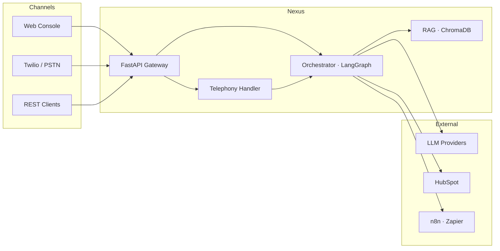

<div align="center">

# Nexus · Voice & Chat AI Platform

**Omnichannel AI agents for contact centers — chat, voice, and copilot in one runtime.**

[](https://github.com/ShubhamRSY/voice-agents/actions/workflows/ci.yml)
[](https://www.python.org/downloads/)
[](LICENSE)
[](tests/)

[Live demo](#quick-start) · [API docs](http://127.0.0.1:8001/docs) · [Architecture](#architecture)

</div>

---

## What it does

Nexus runs **three agent modes** from a single FastAPI backend:

| Mode | Use case |
|------|----------|
| **Chat** | Customer self-service with tools, sessions, and RAG |
| **Voice** | PSTN / Twilio call flows with routing and human transfer |
| **Copilot** | Agent-assist drafts for human support reps |

Every response is grounded in your knowledge base, scored for hallucination risk, and observable via metrics (`grounding_score`, `response_time_ms`, tool calls).

> **No API key required.** Mock LLM + keyword RAG fallback let you run the full stack locally for demos and CI.

---

## Quick start

```bash
git clone https://github.com/ShubhamRSY/voice-agents.git
cd voice-agents

python3 -m venv .venv && source .venv/bin/activate
pip install -r requirements.txt && pip install -e ".[dev]"

cp .env.example .env          # optional — add OPENAI_API_KEY for real LLM
python scripts/ingest_kb.py data/knowledge_base/
./run.sh
```

Open **[http://127.0.0.1:8001](http://127.0.0.1:8001)** — the Nexus console has Chat, Copilot, and Voice tabs built in.

**Try it:**
```bash
curl -s -X POST http://127.0.0.1:8001/api/v1/chat \
  -H "Content-Type: application/json" \
  -d '{"message":"How do I reset my password?","session_id":"demo-1"}' | jq
```

---

## Stack

FastAPI · LangGraph · ChromaDB · Twilio · HubSpot · OpenAI / Anthropic / Gemini

```
┌─────────────┐     ┌──────────────────┐     ┌─────────────┐
│ Web Console │────▶│  Agent Runtime   │────▶│ LLM + Tools │
│ Chat·Voice  │     │ RAG · Guardrails │     │ CRM · iPaaS │
└─────────────┘     └────────┬─────────┘     └─────────────┘
                             │
                    ┌────────▼─────────┐
                    │ ChromaDB · FAQ   │
                    └──────────────────┘
```

---

## Features

**Agents & orchestration**
- LangGraph ReAct loop with per-agent tools, prompts, and LLM params (`config/agents.yaml`)
- Channel-specific templates — voice, chat, copilot — with few-shot and chain-of-thought

**Knowledge & safety**
- RAG pipeline: document ingestion, ChromaDB vectors, keyword fallback
- Guardrails (prompt-injection block, output sanitization)
- Grounding and hallucination scoring on every response

**Integrations**
- Twilio PSTN webhooks, skill-based call routing, SIP headers, human transfer
- HubSpot CRM adapter (mock when no credentials)
- n8n / Zapier lifecycle webhooks

**Ops & quality**
- Nexus web UI — streaming chat, voice HUD, session management, citation chips
- Evaluation suite — containment, tool accuracy, latency, benchmarks
- GitHub Actions CI — unit, E2E, Docker smoke (offline, no keys)

---

## Architecture



**Config-driven** — agent behavior, routing rules, RAG settings, and eval thresholds live in `config/agents.yaml`. No code changes needed to tune an agent.

<details>
<summary><strong>Request flow (chat)</strong></summary>

1. Client → `POST /api/v1/chat`
2. Guardrails check input
3. RAG retriever fetches KB context (semantic + keyword fallback)
4. LangGraph ReAct loop — optional tool calls (CRM, tickets, transfer)
5. Grounding score + metrics returned with response

</details>

---

## API

Full interactive reference: **[`/docs`](http://127.0.0.1:8001/docs)** when the server is running.

| Endpoint | Description |
|----------|-------------|
| `POST /api/v1/chat` | Chat message |
| `POST /api/v1/copilot` | Copilot assist |
| `DELETE /api/v1/chat/{id}` | Clear session |
| `POST /api/v1/rag/search` | Knowledge search |
| `POST /api/v1/telephony/simulate` | Voice call simulator |
| `POST /api/v1/evaluation/run` | Run quality suite |

---

## Telephony (Twilio)

```bash
# .env
TWILIO_ACCOUNT_SID=AC...
TWILIO_AUTH_TOKEN=...
TWILIO_PHONE_NUMBER=+1...
TWILIO_WEBHOOK_BASE_URL=https://your-tunnel.ngrok.io

ngrok http 8001
```

Point your Twilio number voice webhook to `POST {BASE_URL}/api/v1/telephony/voice/inbound`.

---

## Testing

```bash
./scripts/ci.sh              # full suite — unit + E2E + coverage
pytest tests/ tests/e2e/ -v  # quick local run
```

65+ tests run in offline mock mode (no API keys). See [`tests/reports/TEST_REPORT.md`](tests/reports/TEST_REPORT.md) for coverage details.

---

## Project layout

```
voice-agents/
├── config/agents.yaml      # agents, RAG, eval, telephony rules
├── src/
│   ├── api/                # FastAPI routes
│   ├── workflows/          # LangGraph orchestrator
│   ├── rag/                # ingestion, vector store, retriever
│   ├── telephony/          # Twilio, call router
│   ├── llm/                # factory, guardrails, grounding
│   └── integrations/       # CRM, webhooks
├── static/index.html       # Nexus console UI
├── tests/                  # unit + e2e
└── scripts/                # ingest, eval, ci
```

---

## Environment

| Variable | Required | Notes |
|----------|----------|-------|
| `OPENAI_API_KEY` | No | Real GPT + embeddings; mock mode if empty |
| `ANTHROPIC_API_KEY` | No | Anthropic models |
| `TWILIO_*` | No | Real phone integration |
| `HUBSPOT_API_KEY` | No | Live CRM; mock fallback |

Copy `.env.example` → `.env` to get started.

---

## Docker

```bash
docker build -t nexus-voice-agents .
docker run -p 8000:8000 --env-file .env nexus-voice-agents
```

Health check: `GET /api/v1/health`

---

<div align="center">

**MIT** · Built by [Shubham RSY](https://github.com/ShubhamRSY)

</div>
